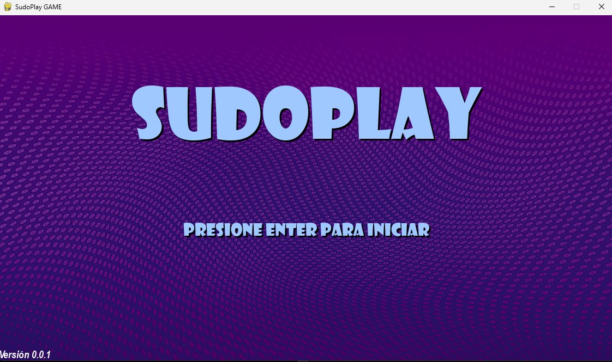
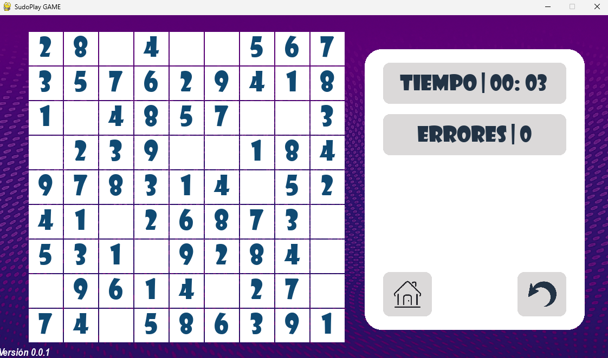

# sudoplay-sudoku

Juego de Sudoku desarrollado en Python con Pygame como proyecto académico de la Tecnicatura en Programación de la UTN.

## Descripción

SudoPlay es un juego de Sudoku con interfaz gráfica desarrollado en Python.

El proyecto permite al jugador seleccionar una dificultad, completar un tablero y recibir validaciones durante la partida. Además, incorpora un sistema de errores, temporizador, puntuación y ranking.

El desarrollo se realizó aplicando conceptos de programación, modularización, manejo de matrices, validación de datos, estructuras de control y manejo de eventos mediante Pygame.

## Funcionalidades

- Menú principal interactivo.
- Selección de dificultad.
- Generación de tableros de Sudoku.
- Validación de números ingresados.
- Contador de errores.
- Temporizador de partida.
- Sistema de puntuación.
- Ranking de jugadores.
- Ingreso de nombre de usuario.
- Interfaz gráfica.
- Efectos de sonido y música.
- Navegación mediante eventos de teclado y mouse.

##  Tecnologías utilizadas

- Python 3.13
- Pygame
- GitHub

##  Capturas

### Menú principal



### Partida



##  Estructura del proyecto

```text
sudoplay-sudoku/

├── juegodefinitivo.py
├── funciones.py
├── constantes.py
├── imágenes/
├── sonidos/
├── README.md
└── .gitignore
